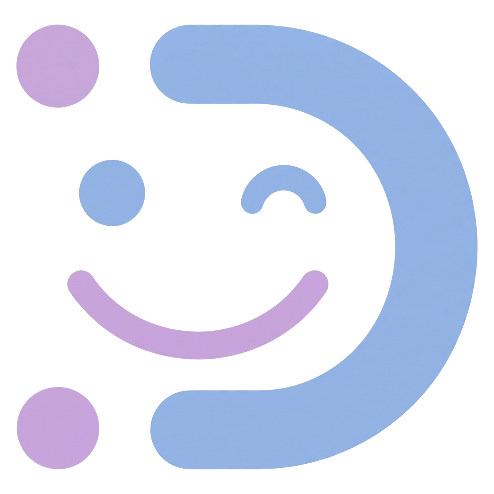

# 🧠 DEMO: Daily Emotion/Mood Organizer

### *One Emotion at a Time*

---

## 📌 Overview

**DEMO** is a lightweight, interactive desktop application built to bridge the gap between *feeling* an emotion and *processing* it. In a world of high-pressure deadlines and burnout, DEMO acts as a circuit breaker for overthinking — helping users move from "spiraling" to "acting" through structured, mood-based recommendations.

Whether you're a student facing academic fatigue or a professional navigating a high-stress environment, DEMO provides the framework to **log, analyze, and regulate your emotional state** before it dictates your decision-making.

> *"You don't have to fix everything today. You just have to feel it, name it, and take one step."*

---

## 🛠️ The Problem & Our Solution

**The Problem:** Emotional fatigue often leads to *"analysis paralysis"* where the mental energy required to choose a coping mechanism is higher than the energy the user actually has.

**The Solution:** By asking one simple question *"What is your mood today?"*  DEMO cuts through the noise and provides a deterministic path toward emotional regulation, removing the burden of choice during a crisis.

---

## 🚀 Core Features

| Feature | The "What" | The "Why" |
|---|---|---|
| 🔐 **Secure Vault** | Multi-user authentication with private data persistence. | Emotional data is sensitive, your logs stay yours. |
| 🎭 **Emotion Pulse-Check** | A curated selection of granular emotional states (Happy, Sad, Angry, Anxious, and more). | Moving beyond "Happy/Sad" to identify the root feeling. |
| 🎯 **Tailored Playbooks** | Dynamic activity suggestions based on your primary and secondary emotion selections. | Turning emotional awareness into immediate, physical action. |
| 📔 **Journal Activity** | Write your thoughts and attach a photo memory for the day. | Externalizing thoughts helps process them like therapy 101. |
| 🎧 **Music Activity** | Opens a curated Spotify playlist matched to your current mood. | Music is a proven emotional regulation tool. |
| ⏱️ **Timer Activity** | A built-in stopwatch for timed physical activities (stretching, walking, breathing). | Movement is the fastest way to shift emotional state. |
| 📈 **Mood Insights** | A chronological calendar history of your emotional journey with activity details. | Identifying patterns helps predict and prevent burnout. |
| 🤖 **AI Consultant** | Integrated chatbot (powered by OpenRouter) for deeper emotional exploration. | For when you need to talk through a feeling in real-time. |

---

## 💻 Tech Stack

| Layer | Technology |
|---|---|
| Language | C# (.NET WinForms) |
| Database | MariaDB (via XAMPP) |
| DB Connector | MySql.Data (MySqlConnector) |
| AI Integration | OpenRouter API (free tier) |
| Architecture | OOP — Abstract classes, Interfaces, Inheritance, Encapsulation |

---

## 🗄️ Database Setup (MariaDB via XAMPP)

DEMO uses **MariaDB** as its database engine, accessed locally through **XAMPP**. Follow these steps exactly.

### Step 1 — Download and Install XAMPP

1. Go to [https://www.apachefriends.org](https://www.apachefriends.org) and download **XAMPP for Windows**.
2. Run the installer and make sure **Apache** and **MySQL (MariaDB)** are selected during setup.
3. Install to the default path (`C:\xampp`).

### Step 2 — Start XAMPP Services

1. Open the **XAMPP Control Panel** (run as Administrator).
2. Click **Start** next to **Apache**.
3. Click **Start** next to **MySQL**.
4. Both should turn green. If MySQL fails to start, check that port `3306` is not being used by another service.

### Step 3 — Create the Database

1. Open your browser and go to `http://localhost/phpmyadmin`.
2. Click **New** in the left panel.
3. Name the database **`emotiondb`** and click **Create**.

### Step 4 — Create the Required Tables

Click on `emotiondb` in the left panel, then open the **SQL** tab and run the following:

```sql
CREATE TABLE users (
    userId VARCHAR(50) PRIMARY KEY,
    fullname VARCHAR(100) NOT NULL,
    email VARCHAR(100) UNIQUE NOT NULL,
    password VARCHAR(100) NOT NULL
);

CREATE TABLE mood_entries (
    id INT AUTO_INCREMENT PRIMARY KEY,
    email VARCHAR(100) NOT NULL,
    primary_emotion VARCHAR(50),
    secondary_emotion VARCHAR(50),
    selected_activity VARCHAR(100),
    is_completed BOOLEAN DEFAULT FALSE,
    date_logged DATE NOT NULL
);

CREATE TABLE activities (
    id INT AUTO_INCREMENT PRIMARY KEY,
    name VARCHAR(100),
    category VARCHAR(50),
    emotionTag VARCHAR(100),
    details TEXT,
    started_at DATETIME,
    ended_at DATETIME,
    created_at TIMESTAMP DEFAULT CURRENT_TIMESTAMP
);
```

### Step 5 — Verify the Connection Settings

The app connects using these default XAMPP credentials (already set in `MariaDbConnector.cs`):

```
Host     : localhost
Port     : 3306
Database : emotiondb
User     : root
Password : (blank — leave empty, this is XAMPP's default)
```

> ⚠️ **Do not change the password** in phpMyAdmin unless you also update it inside `MariaDbConnector.cs`. If you set a MySQL root password, open `MariaDbConnector.cs` and update the `password` field accordingly.

---

## 🤖 AI Chatbot Setup (OpenRouter)

The AI consultant feature uses **OpenRouter**, a free AI gateway. You need an API key to enable it.

1. Go to [https://openrouter.ai](https://openrouter.ai) and create a free account.
2. Navigate to **Keys** and generate a new API key. It will look like `sk-or-v1-...`.
3. Open `AIChatbot.cs` and paste your key here:

```csharp
private string MY_API_KEY = "sk-or-v1-paste-your-key-here";
```

> 💡 Alternatively, set it as a system environment variable named `OPENROUTER_API_KEY` so it doesn't get hardcoded into the source file.

---

## 📖 How to Use DEMO

### 1. 🔐 Sign Up / Log In

- Launch the app. The **Authentication Screen** will appear.
- If you're a new user, click **Sign Up**, fill in your full name, email, and password, then click **Sign Up**.
- If you already have an account, enter your email and password and click **Login**.

---

### 2. 🎭 Select Your Emotion

- After logging in, you'll land on the **Emotion Screen**.
- **Choose your primary emotion** from the options displayed (e.g., Happy, Sad, Angry, Anxious).
- **Choose your secondary emotion** to get more specific (e.g., if primary is Sad → secondary could be Lonely, Hopeless, Disappointed).
- **Choose an activity** from the recommended list, DEMO tailors this list based on your emotion combination.
- Click **Proceed** to move to your dashboard.

> 💡 If you've already logged your emotion today, DEMO will show your previous selection and let you continue where you left off.

---

### 3. 📊 Your Dashboard

The **Dashboard** is your home base for the day. It shows:
- Your selected emotion and activity for the day.
- A calendar view of your past mood entries and click any day to see its full history.
- The **AI Chat panel** on the side where you can talk through your feelings.
- A **View Activity** button to open and complete your recommended activity.

---

### 4. 🎯 Complete Your Activity

Depending on your emotion selection, you'll open one of three activity forms:

#### 📔 Journal Activity
- Write your thoughts freely in the text area.
- Optionally attach a photo memory by clicking the photo panel.
- Click **MARK AS DONE ✓** to save your journal entry and return to the dashboard.

#### 🎧 Music Activity
- Click **OPEN SPOTIFY** to launch the curated playlist matched to your mood.
- Add optional notes or a photo while you listen.
- Click **MARK AS DONE ✓** when you're finished.

#### ⏱️ Timer Activity (Physical)
- Click **▶ START** to begin the stopwatch.
- Pause and resume as needed.
- Add notes or a photo of your activity.
- Click **MARK AS DONE ✓** , the app records your exact start time, end time, and duration.

---

### 5. 📈 View Your History

- From the Dashboard, click any **calendar day** that has a recorded entry.
- The **History View** will open, showing:
  - The date and activity you completed.
  - Time started and time ended.
  - Your journal notes or reflections.
  - The photo you attached (if any).
  - Your primary and secondary emotions for that day.

---

### 6. 🤖 Talk to the AI Consultant

- On the Dashboard, find the **AI Chat panel**.
- Type anything you're feeling, the AI responds conversationally, like a supportive friend.
- It will ask follow-up questions to help you process your emotions further.
- Click **Send** or press **Enter** to chat.

> ⚠️ Requires a valid OpenRouter API key (see setup above).

---

## 🗂️ Project Structure

```
DEMO/
├── Forms/
│   ├── AuthForm.cs              # Login and Sign Up UI
│   ├── EmotionForm.cs           # Emotion & activity selection
│   ├── DashboardForm.cs         # Main hub, calendar, AI chat
│   ├── JournalActivityForm.cs   # Journal writing + photo
│   ├── MusicActivityForm.cs     # Spotify + notes
│   ├── TimerActivityForm.cs     # Stopwatch + photo + notes
│   └── HistoryViewForm.cs       # Past entry detail view
│
├── Models/
│   ├── BaseActivity.cs          # Abstract base for all activities
│   ├── PhysicalActivity.cs      # Timer-based physical entries
│   ├── MentalActivity.cs        # Journal and music entries
│   └── User.cs                  # User account model
│
├── Interfaces/
│   └── IDatabaseAccess.cs       # Save / Fetch / Delete contract
│
├── Services/
│   ├── MariaDbConnector.cs      # DB connection and query runner
│   ├── AIChatbot.cs             # OpenRouter AI integration
│   └── Program.cs               # Entry point
│
└── Properties/                   # Images and app assets
                  
```

---

## ⚙️ Prerequisites

Before running the project, make sure you have:

- ✅ [XAMPP](https://www.apachefriends.org) — for MariaDB (MySQL) local server
- ✅ [Visual Studio 2022](https://visualstudio.microsoft.com/) — Community edition is free
- ✅ .NET Framework (WinForms) — included with Visual Studio
- ✅ `MySql.Data` NuGet package — install via NuGet Package Manager in Visual Studio
- ✅ An [OpenRouter](https://openrouter.ai) API key — free tier available

---

## 🔧 Running the Project

1. Clone or download this repository.
2. Open `DEMO.sln` in **Visual Studio 2022**.
3. In the **NuGet Package Manager**, install:
   ```
   MySql.Data
   ```
4. Make sure XAMPP is running with both **Apache** and **MySQL** started.
5. Create the `emotiondb` database and tables (see **Database Setup** above).
6. Press **F5** or click **▶ Start** to build and run the application.

---

## 👥 Team Autonomyst Developers
Built with 💜 as a project by a team who believe emotional wellness deserves the same engineering attention as any other system.
* Anyayahan, Jerlyn P.
* De Castro, Aaron Rovic D.
* Macatangay, Alwyn Kent M.


## 🙏 Acknowledgement

**Team Autonomyst** extends its heartfelt gratitude to our instructor, **Ms. Fatima Marie Agdon**, for her unwavering commitment to our growth as future software developers throughout this course in **Object-Oriented Programming using C#**.

Her structured approach to teaching core OOP principles including **encapsulation, inheritance, polymorphism, and abstraction** and gave us a solid foundation that we directly applied in building this **Windows Forms (.NET/C#)** application. Every lecture, code walkthrough, and feedback session pushed us to write cleaner, more maintainable, and more purposeful code.

Beyond technical knowledge, Ms. Agdon cultivated a learning environment where asking questions was encouraged and mistakes were treated as stepping stones. Her patience in walking us through debugging sessions and her insightful critiques of our class designs helped us understand not just *how* to code, but *why* good software architecture matters.

The application presented in this repository is a direct reflection of the lessons she imparted from structuring classes responsibly, to designing intuitive WinForms interfaces, to applying real-world OOP thinking in a desktop environment.

We are genuinely grateful for her mentorship, and we carry the principles she taught us forward into every project we build.


